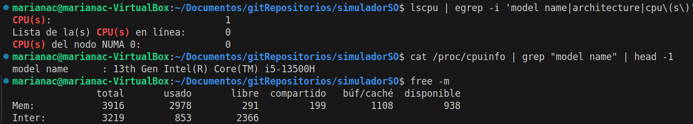
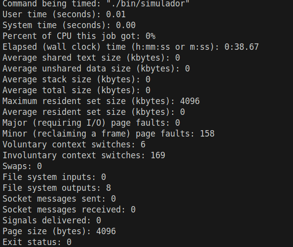

# Informe Final – Simulador de Procesos (C++)

## Portada
- **Curso**: Sistemas Operativos
- **Proyecto**: Simulador Round–Robin
- **Integrantes**: Mariana Carrasquilla, Valentina Zapata, David García
- **Fecha**: 07/08/2025
- **Versión compilador**: g++ (Ubuntu 13.3.0-6ubuntu2~24.04) 13.3.0

---

## 1. Descripción del funcionamiento
- **Entrada**: procesos con registros iniciales (AX, BX, CX) y **Quantum** por proceso; instrucciones por PID.
- **Modos**: 
  - **Archivo** (`procesos.txt` + `instr/<PID>.txt`), 
  - **Consola** (menú).
- **Ejecución**: planificador **Round–Robin** recorre los procesos; en cada quantum ejecuta **ADD, SUB, MUL, INC, JMP, NOP**.
- **Salida**: trazas con carga inicial, detalle por instrucción (efecto en registros y **quantum restante**), pila cuando se agota el quantum, **cambios de contexto** y **estados finales**.

---

## 2. Arquitectura y módulos
- `cargador.*`: lee y valida procesos desde archivo o consola.
- `instrucciones.*`: carga/valida instrucciones; **validador estricto** (solo ADD/SUB/MUL/INC/JMP/NOP).
- `planificador.*`: Round–Robin, impresión paso a paso, pila, cambios de contexto.
- `main.cpp`: menú, orquestación.
- **Logger**: duplicación de stdout/stderr a `.log`.

Diagrama (alto nivel):
```
main → cargador → (procesos)
     → instrucciones → (listas por PID)
     → planificador(RR) → ejecución + trazas + estados finales
```

---

## 3. Resultados



Se puede observar que el programa estuvo ejecutándose 38.67 segundos, de los cuales solo 0.01 sg fue el tiempo real de CPU usado por el programa y 0% de CPU debido a que la mayor parte del tiempo estaba esperando el input.

---

## 4. Conclusiones
- La simulación refleja la **justicia temporal** de Round–Robin y el impacto del **Quantum** en los cambios de contexto.
- La instrumentación permitió estimar el **uso de memoria** y el costo de impresión/logs.
- La validación estricta de instrucciones reduce errores y facilita el análisis de resultados.
- Trabajos futuros: más instrucciones, estados adicionales (“Bloqueado/IO”), **prioridades** y **estadísticas** (turnaround, waiting, response time).
